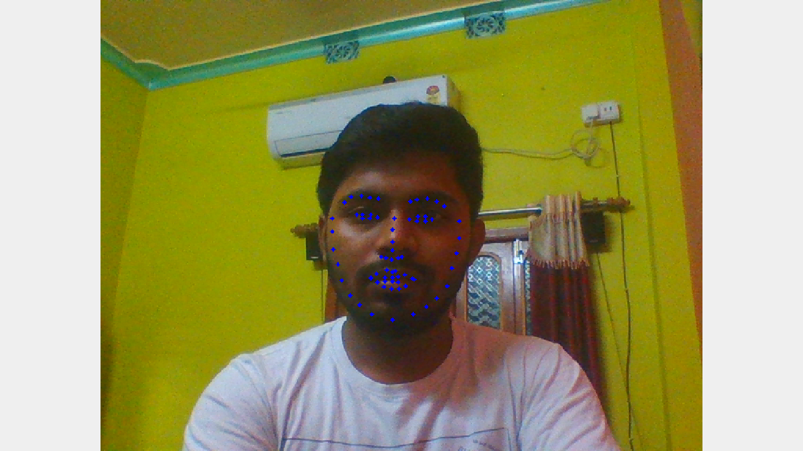
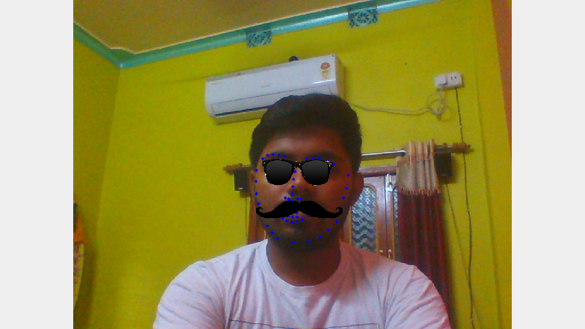

## Overview
  In this project I implented a Facefilter which currently add **Sunglass** and **Moustache** on faces.FacialFilters are use in many places like Facebook,Instagram and many other social networking site. The Key objective here is to accurately place the filter (sunglass, hat or any funny things) on top of the user's face. For this purpose here I have used **Facial Keypoint Detection** using Deep Learning which can locate position of various keypoints of a human face.Here the model is detecting 68 Keypoints of face as shown below

  

## Facial KeyPoint detection
Here I have used 4 Convolution Layer+Pooling Layer with one resnet block (which increases the accuracy much effectively) following by three fully connected layers for predicting 138 points.  
Dropout Layers is also used in between the convolution layer and fully connected layers to reduce the **overfitting** of the model on training data.  
**Adam optimizer** is used here because it avoid local mimimum using momentum, therefore using it with a correct learning rate the model will converge mostly into a global minimum.  
I have used the **SmoothL1 Loss** which give L1 loss for large error and MSE Loss for small error.  

  

  
## Overlay Facial-Filters
  * Detect Faces in a frame using Opencv's HaarCascaad face detector  
  * For each face preprocessed and resized it to feed into the model  
  * Detect the keypoints in faces  
  * Using the detected keypoints overlay the face-filters above the frame  
  

  
  
    
    
## Instruction to run
  * Launch `python main.py`
  * go to **localhost:5000** in browser 
  
## Dependencies - 
  * Opencv
  * Pytorch
  * Numpy
  * Flask

## Note
  To download this repo [**git lfs**](https://git-lfs.github.com./) is required because of large size of saved_models. 

## Acknowledgement
[Udacity Computer Vision Nanodegree](https://www.udacity.com/legal/en-us/computer-vision)
[Udacity Facial keypoint detection](https://github.com/udacity/P1_Facial_Keypoints)
